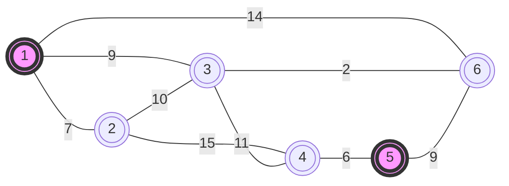
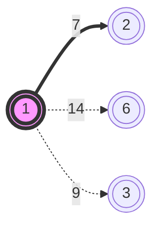

<h1> DIJKASTRA'S </h1>

## Description
Dijkastra's algorithm follows Greedy approach to find the shortest path

Example Covered 

We will be Finding a shortest Path from **1** to **5**

# Solution

We startwith **BFS**  from Node 1

